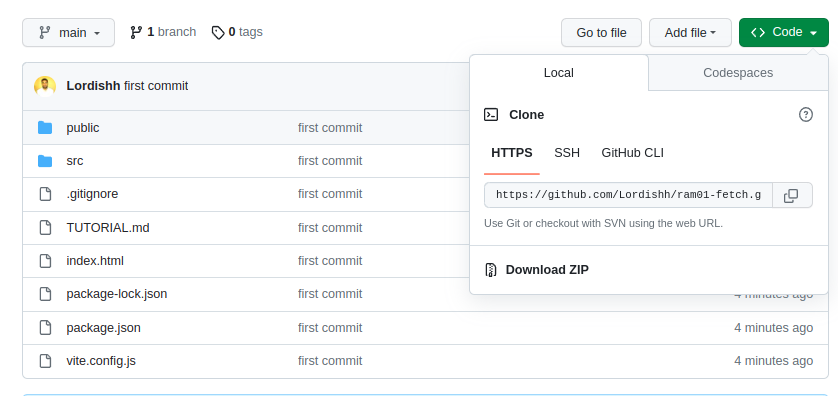
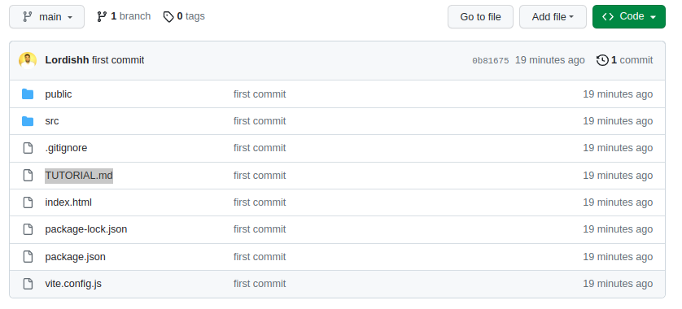

<p align='left'>
  
</P>

---

# `Pasos a seguir`

Descargar este repositorio `Download ZIP` o bien clonar el mismo.



En el caso de haber descargado el repositorio deben descomprimir el archivo y lo abren en su editor de texto preferido.

Para hacer las instalación de dependencias deberán posicionar en la terminal en el directorio raíz del proyecto (donde se encuentra el package.json) y ejecutar el siguiente comando:

```
npm install
```

Una vez realizada la instalación de dependencias ya pueden trabajar con este repo.

Abrir el archivo `TUTORIAL.md` con vista previa. Clic secundario sobre el archivo y seleccionar "Abrir con vista previa" o "open preview" y seguir el tutorial.

Si se sienten más cómodos también pueden abrirlo en este mismo repositorio en GitHub.


