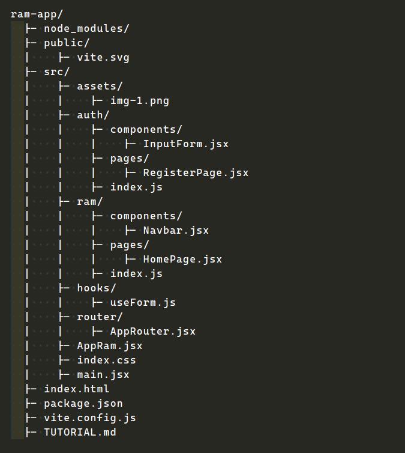
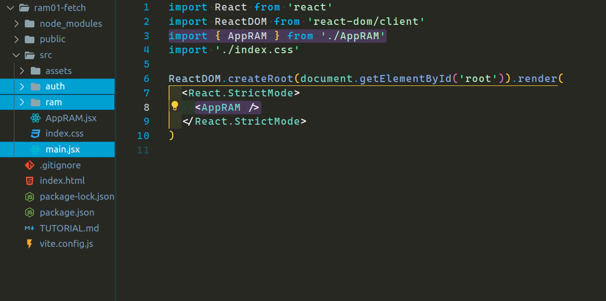
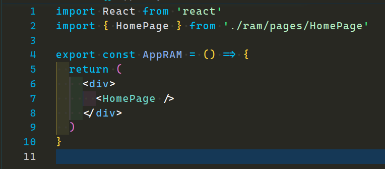
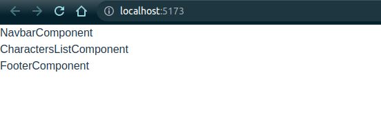
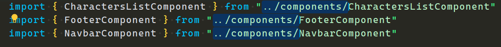
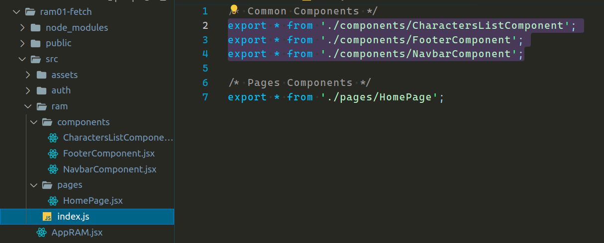
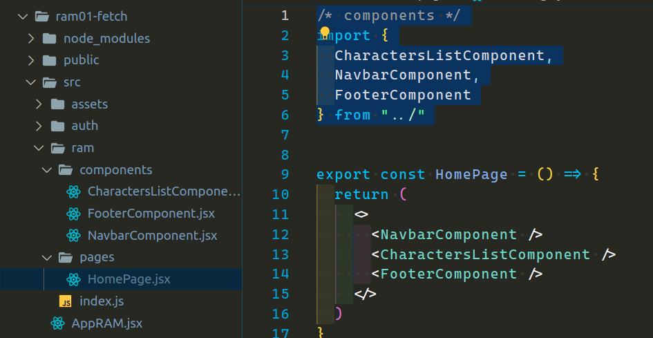
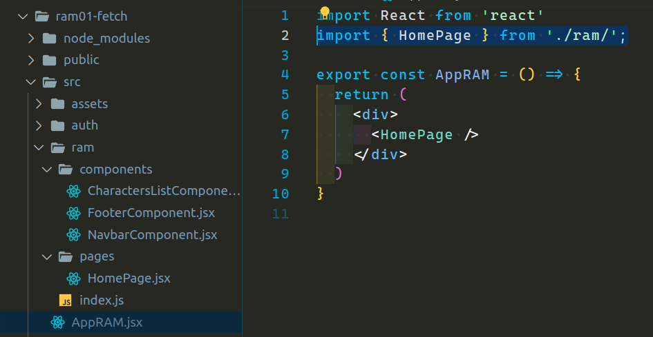

<p align='left'>
  
</P>

---

# `App Rick & Morty`

---

<a id="top"></a>

## `Bloques temáticos:`

- [**Estructura de directorios**](#item1)
- [**inicio de proyecto**](#item2)
- [**Archivos de barril**](#item3)
- [**homework**](#item4)

---

---

<a id="item1"></a>

## `Estructura de carpetas o directorios`

En React, la estructura de carpetas o directorios es flexible y puede variar según las necesidades del proyecto. No existe una estructura de carpetas específica recomendada por React, ya que React en sí mismo es solo una biblioteca de JavaScript y no impone restricciones en cuanto a la organización de archivos.
Sin embargo, quiero compartirles una estructura de carpetas comúnmente utilizada en proyectos de React, aunque esta misma está bastante personalizada también ya que he añadido algunas cositas extras.

Voy a aprovechar para también explicar cada uno de nuestros archivos que dejé para este proyecto y vienen por default con `create vite`.

Mi estructura de directorios y archivos será el siguiente:



- La carpeta "node_modules" contiene todas las dependencias necesarias para nuestra aplicación. Cada librería que instalemos con `npm install` generará las dependencias necesarias en esta carpeta.

- La carpeta "public" contiene un archivo svg que es el favicon de nuestro navegador.
  Se trata de un fichero de configuración donde puedes establecer algunos detalles del funcionamiento del empaquetador en el proyecto actual

- La carpeta "src" la dejaré para lo último, pasaremos al archivo `index.html`: Este es el archivo base html.

- El archivo `package.json` contiene información sobre las dependencias del proyecto y scripts de construcción.

- El archivo `vite.config.js` se trata de un fichero de configuración donde puedes establecer algunos detalles del funcionamiento del empaquetador en el proyecto actual.

- El archivo `TUTORIAL.md` es el que menos sentido tiene explicar. Pero cada proyecto de aquí en adelante traerá uno similar.

- Ahora podemos hablar sobre la carpeta "src". La carpeta "src" contiene el código fuente de la aplicación y es dónde he personalizado mi estructura de directorios y archivos:

  - assets: esta carpeta viene con un archivo basura, la misma se puede conservar para guardar imágenes. En mi caso lo haré para guardar las imágenes de este tutorial.

  - auth: esta carpeta contendrá todo lo relacionado a la autenticación, la misma va a contar con una carpeta "pages" y una carpeta "components", cada una de estas tiene un archivo de ejemplo que son componentes, además de eso, pueden notar un archivo `index.js` al mismo nivel que las carpetas, pero ya hablaremos de este archivo más adelante en este mismo tutorial.

  - ram: esta carpeta será idéntica a la anterior, simplemente que esta contendrá componentes y páginas no relacionadas con la autenticación, ej. una página about, inicio o bien un componente navbar. También cuenta con el "hasta ahora" misterioso archivo `index.js`.

  - router & hook: estas carpetas las dejaremos para analizarlas más adelante así no nos confundimos demasiado.

  - AppRAM.jsx: este archivo fue el que reemplazó al que viene por default App.jsx.

  - index.css: este es un archivo de estilos, normalmente lo cambio a `styles.css` para añadir algunos estilos globales.

  - main.jsx: El archivo `main.jsx` es responsable de renderizar el componente principal (AppRAM.jsx) en el elemento HTML raíz del archivo `index.html`.

[**Subir**](#top)

---

---

<a id="item2"></a>

## `Inicio de proyecto`

Quiero mencionar que la estructura de directorios anterior es el resultado final, sin embargo, iré creando esta misma a medida que lo vaya requiriendo.

Antes de comenzar me voy a dirigir al archivo `index.css` y voy a comentar la siguiente propiedad de estilos del elemento `body`:

```css
/* place-items: center; */
```

Esto es por si quieren ir teniendo el proyecto igual que el mío.

Dicho esto, comencemos. Voy a cambiar el `App.jsx` por `AppRAM.jsx` y lo voy a inyectar en el `main.jsx`. Además ya voy a crear las dos carpetas que utilizaremos en esta unidad `auth` y `ram`. Tal y como se ve en la imagen de nuestra estructura de directorio, esta va dentro de `src`.

---



Así es como se vería nuestro inicio. Algo que debo aclarar es que como pueden ver en la importación de `AppRAM.jsx` lo hago con llaves `"{}"`. Esto es porque a la hora de exportar mi componente y lo hago con "named export", en vez de "default export". Veremos ambos ejemplos:

named export

```jsx
export const AppRAM = () => {};
```

default export

```jsx
const AppRAM = () => {};

export default AppRAM;
```

Vamos a necesitar una página "home" para inyectar un componente que va a contener la lista de mis personajes de `Rick and Morty`. Además, también quiero crear el componente `Navbar` y `Footer`. Estos últimos dos componentes por ahora solo van a tener un `h1` con el nombre del componente.

Para crear estos archivos de componentes vamos a necesitar dos carpetas, "pages" y "componentes". Dentro de estas añadiremos los componentes correspondientes.

En React, es común utilizar dos tipos de componentes: los componentes de páginas (o "page components") y los componentes comunes (o "common components").

---


En el ejemplo anterior estoy creando el componente de página `HomePage.jsx`, y dentro de esta ya voy a inyectar los tres componentes comunes creados. Por el momento y hasta que veamos rutas lo vamos a utilizar así para que vean algo. Después con rutas ya veremos como lo modificamos y organizamos un poco mejor.

Por otro lado, si alguien se está preguntando si los nombres no son algo extenso, está en lo correcto. Los nombres cuanto más cortos puedan ser, mucho mejor, ya que será más fácil de leer el código. ¡Ojo! El nombre del componente debe tener sentido a lo que trata. En mi caso yo los dejaré así para que se vayan acostumbrando a notar la diferencia entre componentes de páginas y componentes comunes ya que a veces esto llega a confundir a algunos. Una vez que se ven las rutas se terminan de comprender algunas cosas. Los componentes de páginas son aquellos que representan las distintas páginas o vistas de tu aplicación. Mientras que los componentes comunes son aquellos que se utilizan en varias partes de la aplicación.

Ahora lo que nos resta es probar que todo funcione hasta aquí. Vamos a inyectar nuestra `HomePage.jsx` en el `AppRAM.jsx` y posteriormente levantar nuestra aplicación.

---



resultado:

---



[**Subir**](#top)

---

---

<a id="item3"></a>

## `Archivos de barril`

Llegó la hora de hablar del misterioso archivo `index.js` que añadí en la imagen de estructura de directorios.

Si prestan atención en nuestro componente de página `HomePage.jsx`, las importaciones de los tres componentes comunes comparten cierta parte del `path`, ya que los tres están dentro de nuestra carpeta `components` dentro de "ram".

---



Voy a crear mi archivo de barril `index.js` dentro de la carpeta "ram", al mismo nivel que las carpetas "components" y "pages". Dentro de este lo que voy a hacer es un export por cada componente o página.

---



Como pueden ver (con ayuda del comodín "\*") estoy haciendo un export de "todo" lo que se encuentre dentro del navbar, characters, footer y home components.

Con este archivo de barril ahora podríamos cambiar nuestras importaciones en nuestro componente de página `HomePage.jsx` de la siguiente manera:

---



Como ven podemos hacer las importaciones sin indicar el `path` con la extensión `/components`, simplemente apuntamos a nuestro archivo de barril.
Esto es totalmente opcional, puede que a algunos les guste como puede que no. Para mí es una excelente forma de entrar a un componente y ver de manera mucho más limpia y de que trata el mismo. Es decir, en mi caso al entrar a `HomePage` me resulta mucho más fácil de entender de qué va ese componente.

Si se dieron cuenta, también estaba exportando la página `HomePage.jsx` en mi archivo de barril, por ende, haré lo mismo con la importación de `AppRAM.jsx`.

No tiene mucho sentido ahora, pero quizá a futuro me sirva.

---



[**Subir**](#top)

---

---

<a id="item4"></a>

## `Homework (requiere ver la clase unidad 2 módulo 2)`

Con el conocimiento adquirido en clase deberán consumir la api de Rick And Morty. Yo dejé un arreglo temporal en `CharacterListComponent.jsx` para más o menos orientarlos. Ustedes deberán quitar ese arreglo temporal y recorrer todos los personajes de la Api.

1 - Dentro del directorio "src", al mismo nivel que "auth" y "ram" vamos a crear un nuevo directorio llamado services (que por cierto me olvidé de mencionar en la estructura de directorios), aquí haremos nuestro llamado a la Api para obtener los personajes.

La Api a consumir es la siguiente:

```
https://rickandmortyapi.com/api/character
```

Pueden comprobarlo e investigar en:
<https://rickandmortyapi.com/documentation/#get-all-characters>

2 - En nuestro componente `CharacterListComponent.jsx` crear nuestros hooks:

- El `useState` deberá tener nuestra variable llamada `character` con su función `setCharacter`, éste hook debe iniciar con un arreglo vacío.

- En el `useEffect` debe ir nuestro fetch, tal y como lo hicimos en clases. Aquí también deben setear nuestro useState con toda la data obtenida.

2 - Crear un nuevo componente que se llamará `CharacterCardComponent`, este mismo puede exportarse en el archivo barril `index.js` para posteriormente importarlo sin tener que poner la extensión `/components/CharacterCard`, pero esto es opcional. Este mismo lo van a reemplazar por el `<li>` del map que recorre todos los personajes. A este componente lo van a reemplazar por el `<li>` del map que recorre todos los personajes y le pasarán las siguientes props que llegan de la Api:

- image
- name

Bonus: Pueden también implementar el loading.
extra credit: Pueden crear login y registro utilizando archivo de barril de la misma manera que lo hicimos en "ram". Creando dos carpetas dentro de "auth", la carpeta "components" y la carpeta "pages".
Nota: No hace falta inyectar estos componentes aún.

---

---

[**Subir**](#top)
